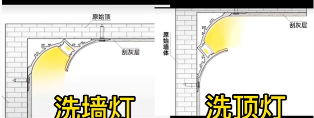
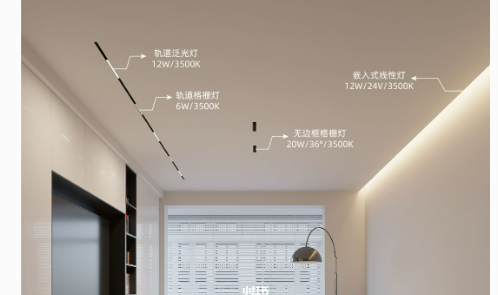
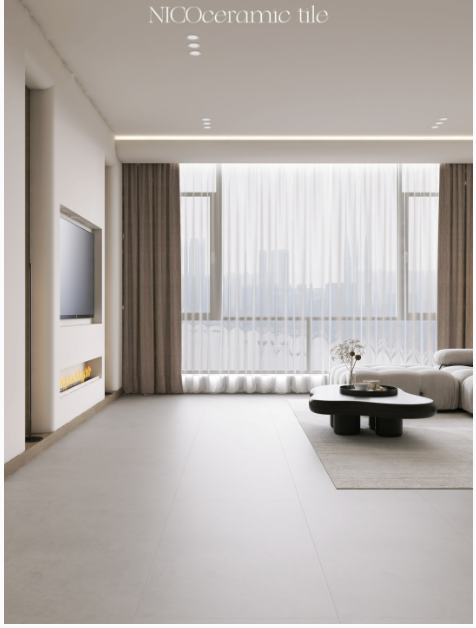

# 我的选择

- [吊顶和灯](#吊顶和灯)
- [瓷砖](#瓷砖)

## 吊顶和灯

客厅不想要吊顶，但是还希望有悬浮效果，是否可以选择[免吊顶悬浮灯槽](https://www.xiaohongshu.com/discovery/item/63400561000000001c03177a?app_platform=android&app_version=7.66.0&share_from_user_hidden=true&type=video&xhsshare=WeixinSession&appuid=5f7c768f000000000100ab58&apptime=1670689576)：

无吊顶的灯带可以走这样的设计。这样看不需要做一圈灯槽，只做沙发这一面即可：

## 瓷砖

毕竟倾向于[这个](https://www.xiaohongshu.com/discovery/item/638dbb59000000001f00d83e?app_platform=android&app_version=7.66.0&share_from_user_hidden=true&type=normal&xhsshare=WeixinSession&appuid=5f7c768f000000000100ab58&apptime=1670690043)说的云雾灰（暖灰色）柔光砖：

[这里](https://www.xiaohongshu.com/discovery/item/638eaf0e000000001f022763?app_platform=android&app_version=7.66.0&share_from_user_hidden=true&type=video&xhsshare=WeixinSession&appuid=5f7c768f000000000100ab58&apptime=1670690452)说 750*1500 可以做到 68元/片。
