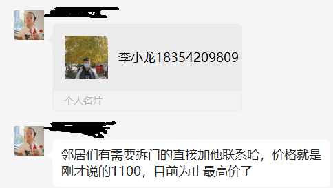
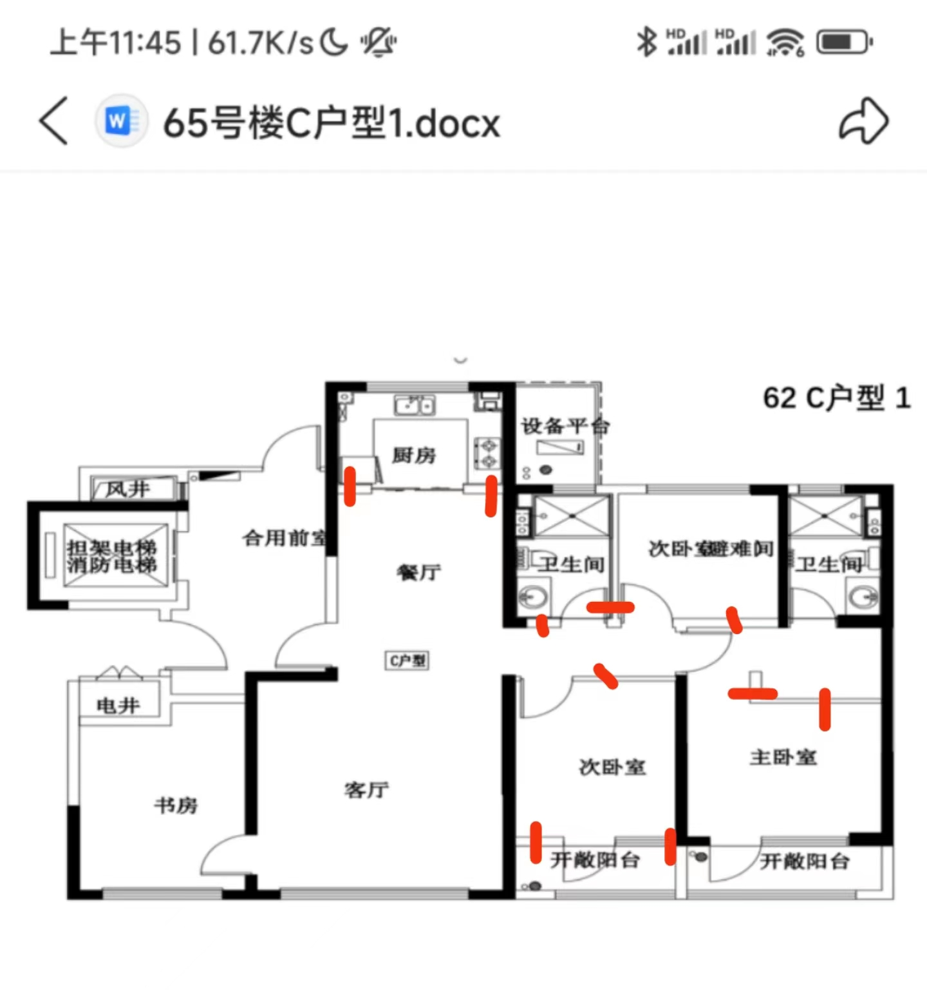
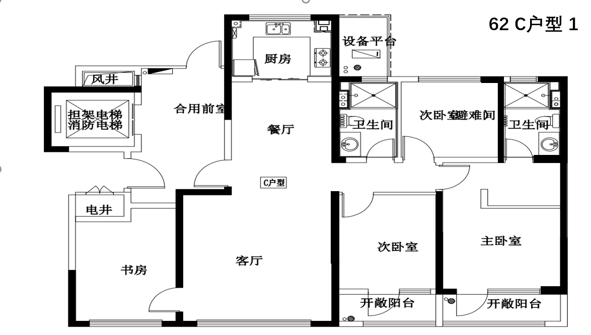
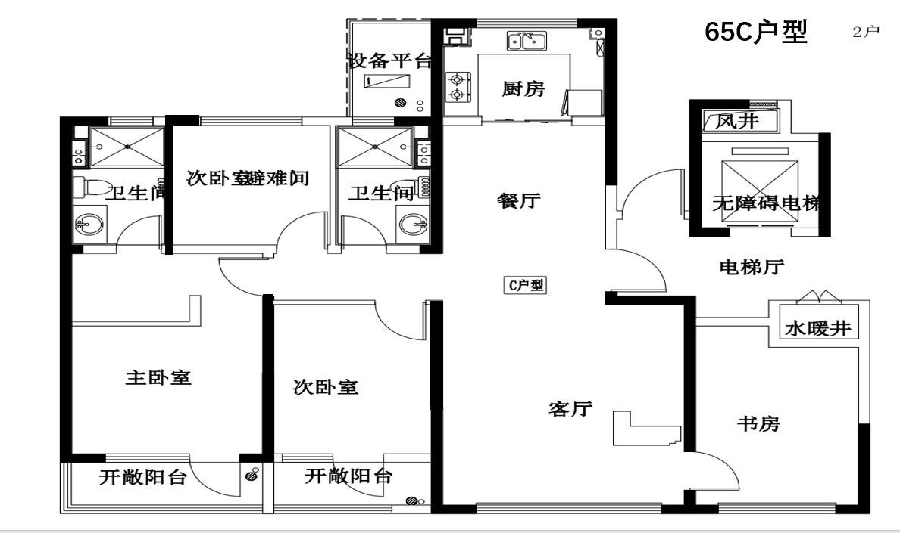

# 拆墙和门

没想到，几座楼户型一样，但承重墙差别还挺大。

## 关于回收

两个阳台门和所有栏杆可以回收，目前回收价格最高的是“李小龙”价格为 1100 元。

上面网友爆料拆门的老板也可以拆墙：

> 回收阳台门➕栏杆1100砸墙20个平方1100，师傅砸完墙给你装袋打包运到物业指定地点，你给物业600他们运出去你就不用管了

该网友砸的墙比较多，如下图所示：

砸墙 20 平就是上述墙面。物业 30 块钱一平方的清运费，所以上述费用为 600 。如果砸墙较少，砸墙和物业清理费还可以更少。

## 65 号楼 

### C 户型 1

（管家说就是这个，虽然写了个 62 号楼）

### C 户型 2

